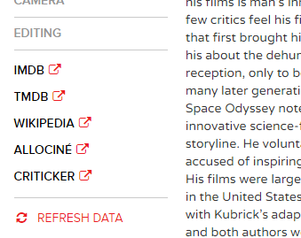
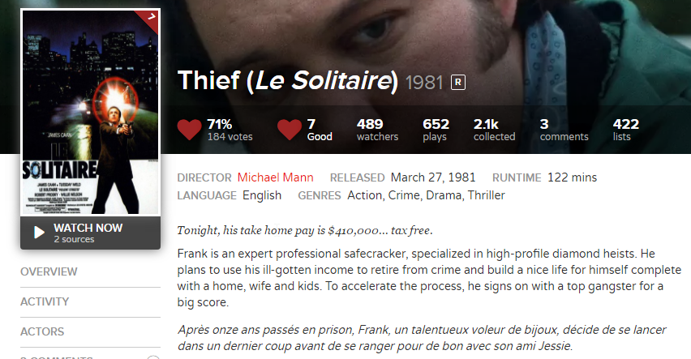
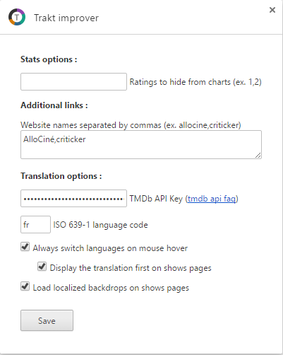

# trakttvstats
A chrome extension adding various improvements to [trakt.tv](https://trakt.tv). Available in the [Chrome Web Store](https://chrome.google.com/webstore/detail/khhjjcbdknmdbdhgkbnldplgoppeehce).

-------------
- [Features](#features)
    - [People statistics & filtering](#people-statistics--filtering)
    - [Layout improvements](#layout-improvements)
    - [Titles, summaries & posters localization](#translation--posters-localization)

-------------
## Features

Filmography charts|Filmography filtering
:--:|:--:
 | 

External links|Translations|Options
:--:|:--:|:--:
 |  | 

### Filmography statistics & filtering

A way to navigate into someone filmography trough your personnal history.

> *What are the films directed by Paul-Thomas Anderson in the 90's that I didn't see ?*

The extension add several charts to the people pages (ex. [Steven Spielberg](https://trakt.tv/people/steven-spielberg)) :

- The number/percentage of his movies I've seen, in total and by job categories (direction, production...).
- The distribution of the ratings for his filmography, by me and the trackt.tv users.
- The distribution of his movies by decade, and the proportion that I've seen.

All these stats are combinable by clicking on the charts.

- Select a donut chart to focus on specific job categories.
- Select a donut slice to focus on movies 'seen' or 'not seen'.
- Select a decade bar to focus on specific decades.

By clicking on charts, the movies list below is neatly organized and filtered, and a summary sentence appears below.

An option allow to skip specific ratings from the related chart. It may be useful if some of your ratings aren't reliable and distort the chart (ex. too many 5's ?).

### Layout improvements

The extension add several features to the site layout and navuigation that can be setup in the option page.

- Add links to any other websites than IMDb, TMDb and Wikipedia on the sidebar of people & shows pages. Ex: ``Allociné, Criticker, SensCritique...``. (List website names or addresses in options, separated by commas)
- Enable multiline titles, to display movies informations in full length in listed views. The title will be on several lines instead of cropped on a single line.

### Translation & posters localization

The extension can translate on the fly movies titles, overviews and localize posters in any language by using the TMDb data. You have to specify a language in the options.

Modes :
- *On mouse hover* : the translation of listed movies is done when an item is hovered. Reduce the number of calls to TMDb.
- *On load* : translate every listed movies of the pages on load. Create numerous calls to TMDb.

Display :
- *Show original & translation* : adds the localized titles or summaries next to the originals.
- *Show translation only* : replace the title and summaries by their localized version.

*Localize posters* replace poster images by their localized version.

You can also specify a custom API Key if you want to use your own or if the default one is down.
