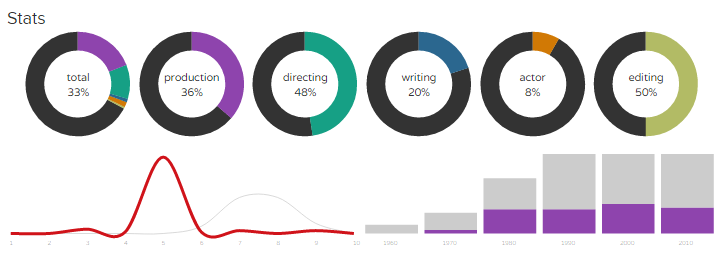
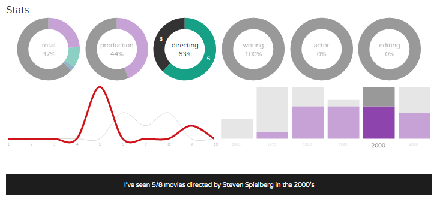

# trakttvstats
A chrome extension adding personal statistics & filtering to [trakt.tv](https://trakt.tv) website.

Works on people page, ex. [trakt.tv/people/steven-spielberg](https://trakt.tv/people/steven-spielberg).

- Movies seen or not, in total and by job categories (direction, production...).
- Ratings distribution (personal ratings & trackt.tv ratings).
- Movies seen or not by decade.

Donuts and years charts are clickable and acts as filters to combine statistics and filter in realtime the movies below.

- Select a donut chart to filter by job categories.
- Select a donut slice to focus on movies 'seen' or 'not seen'.
- Select a decade bar to filter by years.

The charts and the results below will reflect your combinations (ex. only the movies in the writing category, that you didn't see, in the 1970's).

When filtering, a summary sentence appears below. It may be helpful for sharing ! Ex: *There is 2 movies written by Steven Spielberg in the 1970's that I didn't see*.

