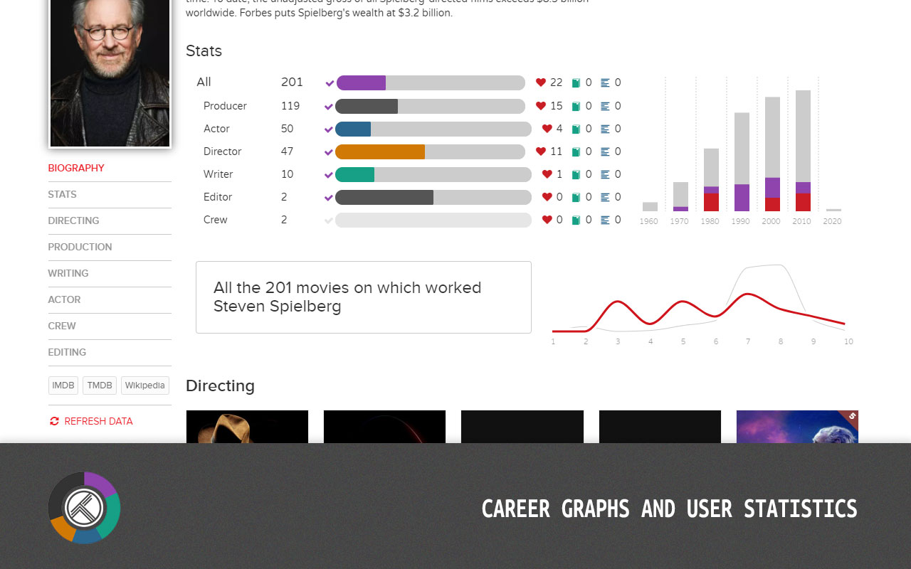
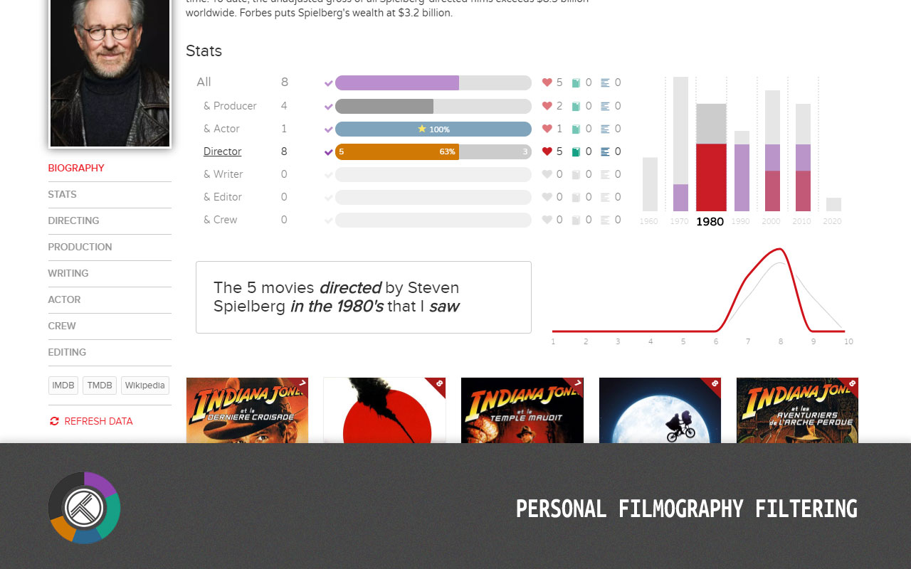
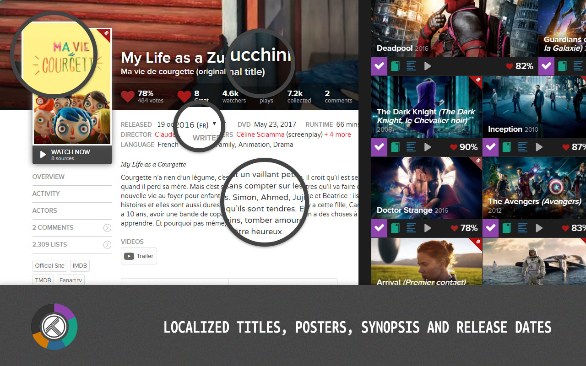
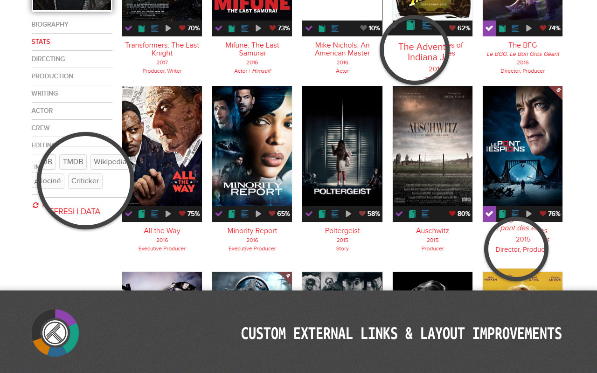

# trakttvstats
A chrome extension adding various improvements to [trakt.tv](https://trakt.tv). Available in the [Chrome Web Store](https://chrome.google.com/webstore/detail/khhjjcbdknmdbdhgkbnldplgoppeehce).

Features

- [Graphs, statistics & filtering](#graphs-statistics--filtering)
- [Translation & localization](#translation--localization)
- [Layout improvements](#layout-improvements)

|
:--:|:--:

|
:--:|:--:

## Graphs, statistics & filtering

A way to navigate into someone filmography trough your personnal history.

> *What are the films directed by Paul-Thomas Anderson in the 90's that I didn't see ?*

The extension add several charts to the people pages (ex. [Steven Spielberg](https://trakt.tv/people/steven-spielberg)) :

- The number/percentage of his movies I've seen, in total and by job categories (direction, production...).
- The distribution of the ratings for his filmography, by me and the trackt.tv users.
- The distribution of his movies by decade, and the proportion that I've seen.

All these stats are combinable by clicking on the charts.

- Select a donut chart to focus on specific job categories.
- Select a donut slice to focus on movies 'seen' or 'not seen'.
- Select a decade bar to focus on specific decades.

By clicking on charts, the movies list below is neatly organized and filtered, and a summary sentence appears below.

An option allow to skip specific ratings from the related chart. It may be useful if some of your ratings aren't reliable and distort the chart (ex. too many 5's ?).

## Translation & localization

By specifying a language code in the options, you'll enable the following features :
- Localized titles (show the localized and/or original title in addition to the english one)
- Localized synopsis and biography
- Localized posters
- Localized release dates (list all the releases dates, not only the US one, and show the most relevant one)

Translations and localized data uses the TMDb API. The language code, as [defined in the TMDb API](https://developers.themoviedb.org/3/getting-started/languages) :
>  is a bare [ISO-639-1](https://en.wikipedia.org/wiki/List_of_ISO_639-1_codes) code [*and*] you can specify an extra [ISO-3166-1](https://en.wikipedia.org/wiki/ISO_3166-1_alpha-2) tag

For example `fr`, `de`, or `pt-BR`.

Settings | Description
--|--
Translate items | - *On mouse hover* do less calls to the API - *On load* translate every movie of the page at once
Localized synopsis | - *Show both* : display the localized version under the english one. - *Replace original* : display only the localized version. - *Disable* : just don't.
Localized posters | - *Replace original* : display only the localized version.  - *Original on hover* : display the localized version, and show the original on mouse over. - *Localized on hover* : show the localized version on mouse over. - *Disable* : just don't.
Custom TMDb API Key | **(optionnal)** if you want to call the API trough your own TMDb account

## Layout improvements

The extension add several features to the site layout and navigation that can be setup in the option page.

### Custom external links

Add links to any other websites than IMDb, TMDb and Wikipedia on the sidebar.

Ex: `Allociné, Criticker, SensCritique...`

List website names separated by commas. The feature will use Google "*I'm lucky*" to redirect to the first Google search result related to the given term and the page title. Ex: `Deadpool 2016 Criticker`. If there is no certain result, Google may redirect to the search result page.

### Multiline titles

By default, the titles under the posters are cropped to a single line to maintain a strict layout :

    Indiana Jones and the...

You can disable this behavior and show the title in full glory by enabling this option in the settings.

    Indiana Jones and the
    Temple of Doom
