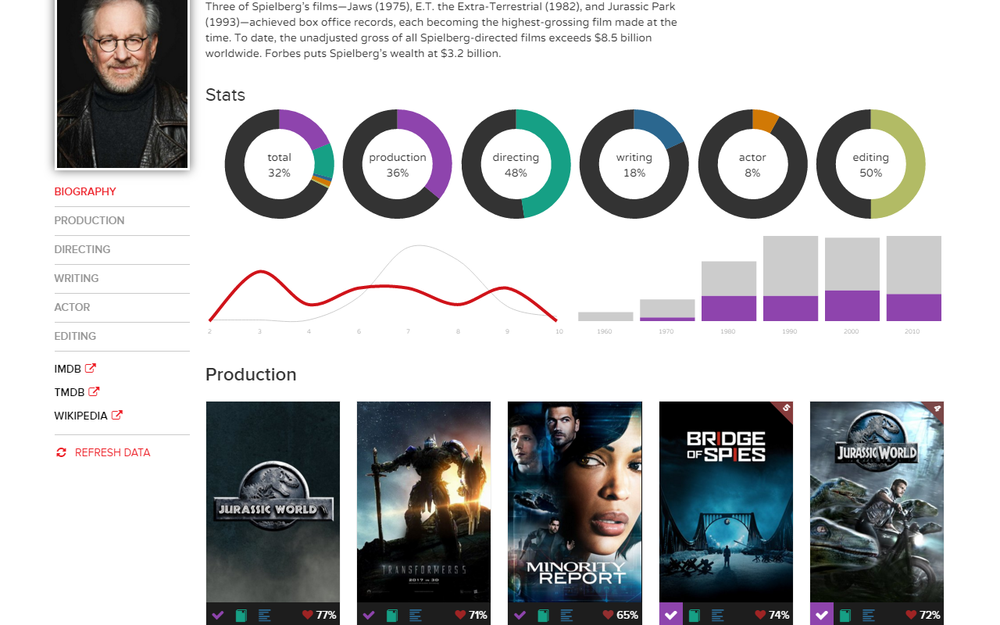
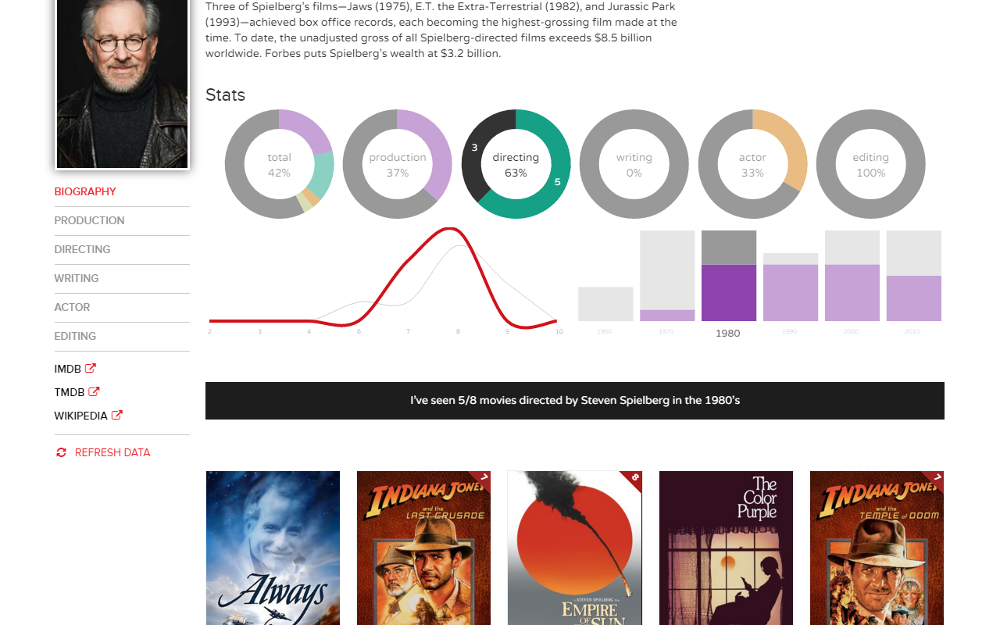

# trakttvstats
A chrome extension adding various improvements to [trakt.tv](https://trakt.tv).

## People statistics & filtering

Personnal statistics & filters are added to people pages (ex. [trakt.tv/people/steven-spielberg](https://trakt.tv/people/steven-spielberg)) :

- Movies I've seen or not of this person, in total and by job categories (direction, production...).
- Ratings distribution (personal ratings & trackt.tv ratings).
- Movies I've seen or not by decade.

All these stats are combinable by clicking on the charts. Ex : Films directed by X in the 90's that I didn't see.

- Select a donut chart to focus on specific job categories.
- Select a donut slice to focus on movies 'seen' or 'not seen'.
- Select a decade bar to focus on specific decades.

**Filtering**

The charts acts also as filters to the movies list below.
So it's not just statistics, it's especially a way to navigate into someone filmography trough your personnal history. Not only how many but "**which films** written by X in the 70's I haven't seen ?".

When filtering, a summary sentence appears below. It may be helpful for sharing.

**Options :**

- Ratings to hide from chart : a comma separated list of ratings (from 1 to 10) to hide from the related chart. May be useful if some of your ratings aren't reliable (ex. too many 5's ?).

## Custom external links

Add links to any other website than IMDb, TMDb and Wikipedia on people & shows pages. Ex: ``allocine,criticker...``.

## Translation

The extension may translate on the fly movies titles, informations (ex. overview) and images, in any language available on TMDb.

On search results, lists, etc. the translation occur only when hovering the posters, to minimize loads.

The following options are available :

- ISO 639-1 language code (required)
- TMDb API Key (required)
- Always switch languages on mouse hover : by default the translations replace the english ones. With this option the translations are visible only when hovering a poster.
    - Display the translation first on shows pages : if the previous option is active, display anyway the ranslated data of a show page first, and show the english data on hover.
- Localize backdrops : display localized background images on show pages
